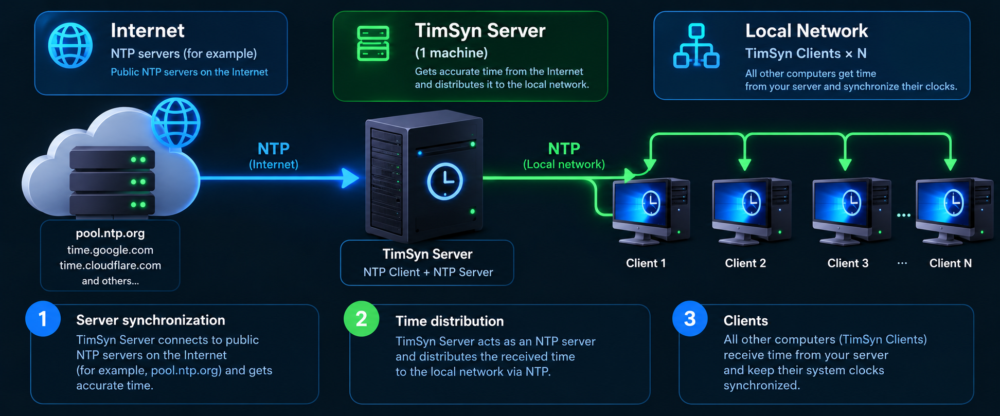

<div align="right">

🌐 **Language / Язык / Til:** &nbsp; **English** &nbsp;|&nbsp; [Русский](README.ru.md) &nbsp;|&nbsp; [O'zbek](README.uz.md)

</div>

# TimSyn — NTP Time Synchronization Suite

<div align="center">

**Local NTP server + client for time synchronization on networks without internet access**

[](https://github.com/Shtilluz/TimSyn/actions)
[](LICENSE)
[]()
[]()

---

### Developed by [MIDGRO.UZ](https://midgro.uz)
**info@midgro.uz**

</div>

---

## What is it

TimSyn is a pair of lightweight GUI applications for time synchronization in isolated local networks without internet access.



**Server** — installed on the one machine with internet access. Pulls accurate time from NTP and serves it to the local network.  
**Client** — installed on all other PCs. Gets time from the server and sets the system clock.

---

## Why TimSyn and not ntpd / w32tm?

Traditional NTP tools require editing config files, managing services, and knowing your way around the command line — that's fine for sysadmins, but not for everyone.

**TimSyn is built for simplicity:**

| Traditional NTP setup | TimSyn |
|---|---|
| Edit `/etc/ntp.conf` or Group Policy | Just run the app |
| Configure firewall rules manually | One port field in the UI |
| No visual feedback — check logs | Live offset, RTT, color-coded status |
| Separate server and client daemons | One `.exe` per role, double-click to start |
| Requires IT knowledge to deploy | Works for any user, any PC |

> **Server:** run → auto-starts → done.  
> **Client:** run → enter server IP → synchronized.

---

## Features

| Feature | Server | Client |
|---|:---:|:---:|
| Sync from public NTP (internet) | ✓ | — |
| Acts as NTP server for local network | ✓ | — |
| Sync from another TimSyn / NTP server | ✓ | — |
| Receive time from local network | — | ✓ |
| Set system clock | ✓ | ✓ |
| Auto-sync on a timer | ✓ | ✓ |
| Configurable ports (in / out) | ✓ | ✓ |
| Choose network interface | ✓ | — |
| Show offset and RTT | ✓ | ✓ |
| EN / RU / UZ interface | ✓ | ✓ |
| Minimize to system tray | ✓ | ✓ |
| Run at system startup (autostart) | ✓ | ✓ |
| Restart as Administrator | ✓ | ✓ |
| No additional software required | ✓ | ✓ |

---

## Download

> Ready-to-run binaries are built automatically via GitHub Actions.

| Platform | Files |
|---|---|
| Windows | `TimSyn_Server.exe`, `TimSyn_Client.exe` |
| Linux x86-64 | `TimSyn_Server`, `TimSyn_Client` |

Download the latest build: **[Actions → latest successful run → Artifacts](../../actions)**

---

## Quick Start

### Windows
```
Server (machine with internet):
  1. Download TimSyn_Server.exe → run as Administrator
  2. Set NTP server (default: pool.ntp.org)
  3. Click "Start Server" — it starts automatically on launch

Client (all other PCs):
  1. Download TimSyn_Client.exe → run
  2. Enter the server IP and port
  3. Click "Synchronize"
```

### Linux
```bash
chmod +x TimSyn_Server TimSyn_Client

# Server (needs root for port 123):
sudo ./TimSyn_Server

# Client:
./TimSyn_Client
```

> **Port 123** requires Administrator / root privileges.  
> Alternative: set any port above 1024 (e.g. **12300**) in both server and client settings.

---

## Run from source

Requires Python 3.8+ with tkinter (included in standard Python installs).

```bash
git clone https://github.com/Shtilluz/TimSyn.git
cd TimSyn

# On the machine with internet:
python server/timsyn_server.py

# On local network machines:
python client/timsyn_client.py
```

Optional (for system tray icon):
```bash
pip install pystray Pillow
```

---

## Build standalone executables

```bash
pip install pyinstaller pystray Pillow
python build/build.py
# Output: build/dist/TimSyn_Server  and  build/dist/TimSyn_Client
```

On Windows the same commands produce `.exe` files.

---

## Project structure

```
TimSyn/
├── server/
│   └── timsyn_server.py     # NTP server with GUI
├── client/
│   └── timsyn_client.py     # NTP client with GUI
├── build/
│   ├── build.py             # build script
│   └── make_icon.py         # icon generator
├── .github/
│   └── workflows/
│       └── build.yml        # GitHub Actions (Windows + Linux)
├── icon.png                 # application icon
├── LICENSE                  # MIDGRO Open Attribution License
└── README.md
```

---

## License

Distributed under the **MIDGRO Open Attribution License (MOAL) v1.0**.  
Free to use, modify, and sell — attribution to [MIDGRO.UZ](https://midgro.uz) is required.  
Details: [LICENSE](LICENSE)

---

<div align="center">

Made with ♥ by **[MIDGRO.UZ](https://midgro.uz)**  
Questions: **info@midgro.uz**

</div>
