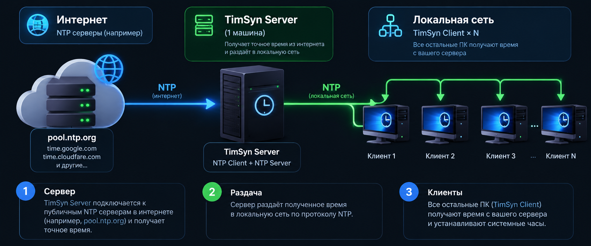

<div align="right">

🌐 **Language / Язык / Til:** &nbsp; [English](README.md) &nbsp;|&nbsp; **Русский** &nbsp;|&nbsp; [O'zbek](README.uz.md)

</div>

# TimSyn - Синхронизация времени по NTP

<div align="center">

**Локальный NTP-сервер + клиент для синхронизации времени в сетях без интернета**

[](https://github.com/Shtilluz/TimSyn/actions)
[](LICENSE)
[]()
[]()

---

### Разработано [MIDGRO.UZ](https://midgro.uz)
**info@midgro.uz**

</div>

---

## Что это

TimSyn - пара лёгких программ с графическим интерфейсом для синхронизации времени в изолированных локальных сетях без доступа в интернет.



**Сервер** - устанавливается на одну машину с интернетом. Тянет точное время с NTP и раздаёт в локальную сеть.  
**Клиент** - устанавливается на все остальные ПК. Получает время с сервера и устанавливает на системные часы.

---

## Зачем TimSyn, если есть ntpd / w32tm?

Стандартные NTP-инструменты требуют редактирования конфигов, настройки служб и работы с командной строкой - это нормально для системного администратора, но не для рядового пользователя.

**TimSyn сделан для простоты:**

| Обычная настройка NTP | TimSyn |
|---|---|
| Правка `/etc/ntp.conf` или групповых политик | Просто запустить программу |
| Ручная настройка правил файрвола | Одно поле «Порт» в интерфейсе |
| Нет визуального статуса - смотри логи | Отклонение, RTT, цветовая индикация |
| Отдельные демоны для сервера и клиента | Один `.exe` на каждую роль, двойной клик |
| Нужны знания IT для развёртывания | Работает для любого пользователя, на любом ПК |

> **Сервер:** запустил → сам стартует → готово.  
> **Клиент:** запустил → ввёл IP сервера → синхронизировано.

---

## Возможности

| Функция | Сервер | Клиент |
|---|:---:|:---:|
| Синхронизация с публичным NTP (интернет) | ✓ | - |
| Работа как NTP-сервер для локальной сети | ✓ | - |
| Источник - другой TimSyn / NTP сервер | ✓ | - |
| Получение времени из локальной сети | - | ✓ |
| Установка системного времени | ✓ | ✓ |
| Авто-синхронизация по таймеру | ✓ | ✓ |
| Настройка портов (входящий / исходящий) | ✓ | ✓ |
| Выбор сетевого интерфейса | ✓ | - |
| Показ отклонения и RTT | ✓ | ✓ |
| Интерфейс EN / RU / UZ | ✓ | ✓ |
| Сворачивание в системный трей | ✓ | ✓ |
| Автозапуск при старте системы | ✓ | ✓ |
| Перезапуск от Администратора | ✓ | ✓ |
| Не требует установки доп. ПО | ✓ | ✓ |

---

## Скачать

> Готовые бинарники собираются автоматически через GitHub Actions.

| Платформа | Файлы |
|---|---|
| Windows | `TimSyn_Server.exe`, `TimSyn_Client.exe` |
| Linux x86-64 | `TimSyn_Server`, `TimSyn_Client` |

Скачать последнюю сборку: **[Actions → последний успешный run → Artifacts](../../actions)**

---

## Быстрый старт

### Windows
```
Сервер (машина с интернетом):
  1. Скачать TimSyn_Server.exe → запустить от Администратора
  2. Указать NTP-сервер (по умолчанию pool.ntp.org)
  3. Нажать "Запустить сервер" - при следующем запуске стартует автоматически

Клиент (все остальные ПК):
  1. Скачать TimSyn_Client.exe → запустить
  2. Указать IP сервера и порт
  3. Нажать "Синхронизировать"
```

### Linux
```bash
chmod +x TimSyn_Server TimSyn_Client

# Сервер (нужен root для порта 123):
sudo ./TimSyn_Server

# Клиент:
./TimSyn_Client
```

> **Порт 123** требует прав Администратора / root.  
> Альтернатива - указать любой порт выше 1024 (например **12300**) в настройках сервера и клиента.

---

## Запуск из исходников

Требуется Python 3.8+ с tkinter (входит в стандартную установку Python).

```bash
git clone https://github.com/Shtilluz/TimSyn.git
cd TimSyn

# На машине с интернетом:
python server/timsyn_server.py

# На локальных машинах:
python client/timsyn_client.py
```

Опционально (для иконки в трее):
```bash
pip install pystray Pillow
```

---

## Сборка исполняемых файлов

```bash
pip install pyinstaller pystray Pillow
python build/build.py
# Результат: build/dist/TimSyn_Server  и  build/dist/TimSyn_Client
```

На Windows те же команды дадут `.exe` файлы.

---

## Структура проекта

```
TimSyn/
├── server/
│   └── timsyn_server.py     # NTP-сервер с GUI
├── client/
│   └── timsyn_client.py     # NTP-клиент с GUI
├── build/
│   ├── build.py             # скрипт сборки
│   └── make_icon.py         # генератор иконки
├── .github/
│   └── workflows/
│       └── build.yml        # GitHub Actions (Windows + Linux)
├── icon.png                 # иконка приложения
├── LICENSE                  # MIDGRO Open Attribution License
└── README.md
```

---

## Лицензия

Распространяется под **MIDGRO Open Attribution License (MOAL) v1.0**.  
Можно использовать, изменять и продавать - при обязательном упоминании [MIDGRO.UZ](https://midgro.uz).  
Подробности: [LICENSE](LICENSE)

---

<div align="center">

Сделано с ♥ командой **[MIDGRO.UZ](https://midgro.uz)**  
По вопросам: **info@midgro.uz**

</div>
