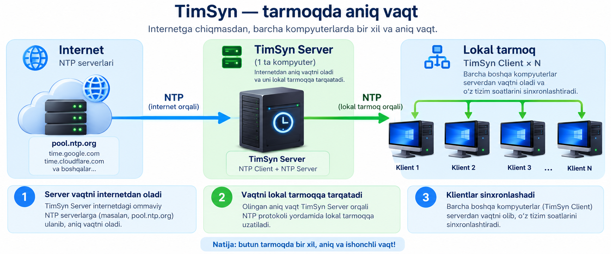

<div align="right">

🌐 **Language / Язык / Til:** &nbsp; [English](README.md) &nbsp;|&nbsp; [Русский](README.ru.md) &nbsp;|&nbsp; **O'zbek**

</div>

# TimSyn — NTP Vaqt Sinxronizatsiyasi

<div align="center">

**Internetga ulanmagan tarmoqlarda vaqtni sinxronlash uchun lokal NTP server + mijoz**

[](https://github.com/Shtilluz/TimSyn/actions)
[](LICENSE)
[]()
[]()

---

### Ishlab chiqaruvchi: [MIDGRO.UZ](https://midgro.uz)
**info@midgro.uz**

</div>

---

## Bu nima

TimSyn — internetga ulanmagan izolyatsiya qilingan lokal tarmoqlarda vaqtni sinxronlash uchun mo'ljallangan ikkita yengil grafik dastur.



**Server** — internetga ulangan bitta kompyuterga o'rnatiladi. NTP dan aniq vaqtni oladi va lokal tarmoqqa tarqatadi.  
**Mijoz** — qolgan barcha PKlarga o'rnatiladi. Serverdan vaqtni olib, tizim soatini sozlaydi.

---

## Nega TimSyn, ntpd / w32tm emas?

Oddiy NTP vositalari konfiguratsiya fayllarini tahrirlashni, xizmatlarni sozlashni va buyruq satri bilan ishlashni talab qiladi — bu tizim administratori uchun yaxshi, lekin oddiy foydalanuvchi uchun emas.

**TimSyn soddalik uchun yaratilgan:**

| Oddiy NTP sozlamalari | TimSyn |
|---|---|
| `/etc/ntp.conf` yoki guruh siyosatini tahrirlash | Dasturni ishga tushirish kifoya |
| Xavfsizlik devori qoidalarini qo'lda sozlash | Interfeysda bitta «Port» maydoni |
| Vizual holat yo'q — loglarga qarang | Farq, RTT, rang ko'rsatkichlari |
| Server va mijoz uchun alohida daemonlar | Har bir rol uchun bitta `.exe`, ikki marta bosish |
| Joylashtirish uchun IT bilimlari kerak | Har qanday foydalanuvchi, har qanday PK uchun |

> **Server:** ishga tushirdi → o'zi boshlaydi → tayyor.  
> **Mijoz:** ishga tushirdi → server IP sini kiritdi → sinxronlashdi.

---

## Imkoniyatlar

| Funksiya | Server | Mijoz |
|---|:---:|:---:|
| Ommaviy NTP bilan sinxronlash (internet) | ✓ | — |
| Lokal tarmoq uchun NTP server bo'lib ishlash | ✓ | — |
| Boshqa TimSyn / NTP serverdan sinxronlash | ✓ | — |
| Lokal tarmoqdan vaqt olish | — | ✓ |
| Tizim soatini sozlash | ✓ | ✓ |
| Taymer bo'yicha avtomatik sinxronlash | ✓ | ✓ |
| Portlarni sozlash (kiruvchi / chiquvchi) | ✓ | ✓ |
| Tarmoq interfeysini tanlash | ✓ | — |
| Farq (offset) va RTT ko'rsatish | ✓ | ✓ |
| EN / RU / UZ interfeysi | ✓ | ✓ |
| Tizim tepsisiga (tray) yig'ish | ✓ | ✓ |
| Tizim ishga tushganda avtomatik yoqilish | ✓ | ✓ |
| Administrator sifatida qayta ishga tushirish | ✓ | ✓ |
| Qo'shimcha dastur o'rnatish shart emas | ✓ | ✓ |

---

## Yuklab olish

> Tayyor bajariladigan fayllar GitHub Actions orqali avtomatik yaratiladi.

| Platforma | Fayllar |
|---|---|
| Windows | `TimSyn_Server.exe`, `TimSyn_Client.exe` |
| Linux x86-64 | `TimSyn_Server`, `TimSyn_Client` |

So'nggi versiyani yuklab olish: **[Actions → oxirgi muvaffaqiyatli run → Artifacts](../../actions)**

---

## Tez boshlash

### Windows
```
Server (internetga ulangan kompyuter):
  1. TimSyn_Server.exe ni yuklab oling → Administrator sifatida ishga tushiring
  2. NTP serverni belgilang (standart: pool.ntp.org)
  3. "Serverni Ishga Tushirish" tugmasini bosing — keyingi ishga tushirishda avtomatik boshlanadi

Mijoz (qolgan barcha PKlar):
  1. TimSyn_Client.exe ni yuklab oling → ishga tushiring
  2. Server IP manzili va portini kiriting
  3. "Sinxronlash" tugmasini bosing
```

### Linux
```bash
chmod +x TimSyn_Server TimSyn_Client

# Server (123-port uchun root kerak):
sudo ./TimSyn_Server

# Mijoz:
./TimSyn_Client
```

> **123-port** Administrator / root huquqlarini talab qiladi.  
> Muqobil: server va mijoz sozlamalarida 1024 dan yuqori portni belgilang (masalan **12300**).

---

## Manba koddan ishga tushirish

Python 3.8+ va tkinter kerak (standart Python o'rnatilishiga kiradi).

```bash
git clone https://github.com/Shtilluz/TimSyn.git
cd TimSyn

# Internetga ulangan kompyuterda:
python server/timsyn_server.py

# Lokal tarmoq kompyuterlarida:
python client/timsyn_client.py
```

Ixtiyoriy (tray ikonkasi uchun):
```bash
pip install pystray Pillow
```

---

## Bajariladigan fayllarni yaratish

```bash
pip install pyinstaller pystray Pillow
python build/build.py
# Natija: build/dist/TimSyn_Server  va  build/dist/TimSyn_Client
```

Windows da xuddi shu buyruqlar `.exe` fayllarni yaratadi.

---

## Loyiha tuzilmasi

```
TimSyn/
├── server/
│   └── timsyn_server.py     # GUI bilan NTP server
├── client/
│   └── timsyn_client.py     # GUI bilan NTP mijoz
├── build/
│   ├── build.py             # yig'ish skripti
│   └── make_icon.py         # ikonka generatori
├── .github/
│   └── workflows/
│       └── build.yml        # GitHub Actions (Windows + Linux)
├── icon.png                 # dastur ikonkasi
├── LICENSE                  # MIDGRO Open Attribution License
└── README.md
```

---

## Litsenziya

**MIDGRO Open Attribution License (MOAL) v1.0** asosida tarqatiladi.  
[MIDGRO.UZ](https://midgro.uz) ga havola qilingan holda foydalanish, o'zgartirish va sotish mumkin.  
Batafsil: [LICENSE](LICENSE)

---

<div align="center">

**[MIDGRO.UZ](https://midgro.uz)** jamoasi ♥ bilan yaratdi  
Savollar uchun: **info@midgro.uz**

</div>
